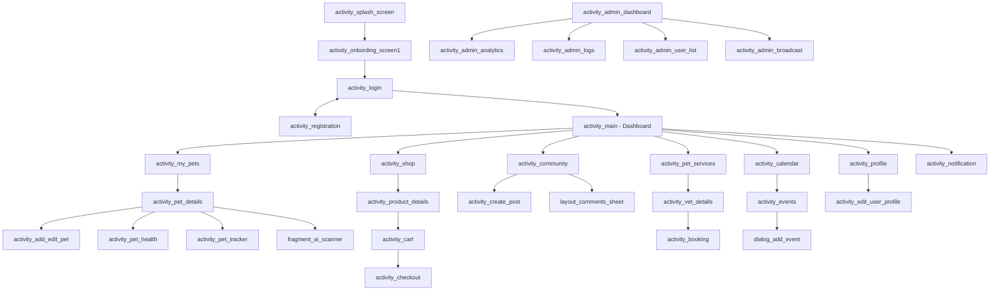

# Project Layout Information

This document provides a comprehensive overview of the XML layout files used in the Tail Wagging Pet Care application.

## Activity Layouts
These define the primary screens and user interfaces for the application's activities.

| File Name | Description |
| :--- | :--- |
| [activity_add_edit_pet.xml](file:///F:/Code/android_app/Tail-wagging-pet-care-app/app/src/main/res/layout/activity_add_edit_pet.xml) | UI for adding a new pet or editing an existing one's profile. |
| [activity_admin_analytics.xml](file:///F:/Code/android_app/Tail-wagging-pet-care-app/app/src/main/res/layout/activity_admin_analytics.xml) | Dashboard for administrators to view system usage statistics. |
| [activity_admin_broadcast.xml](file:///F:/Code/android_app/Tail-wagging-pet-care-app/app/src/main/res/layout/activity_admin_broadcast.xml) | Interface for admins to send system-wide notifications. |
| [activity_admin_dashboard.xml](file:///F:/Code/android_app/Tail-wagging-pet-care-app/app/src/main/res/layout/activity_admin_dashboard.xml) | Central hub for administrative tasks. |
| [activity_admin_logs.xml](file:///F:/Code/android_app/Tail-wagging-pet-care-app/app/src/main/res/layout/activity_admin_logs.xml) | Viewer for system audit and user activity logs. |
| [activity_admin_user_list.xml](file:///F:/Code/android_app/Tail-wagging-pet-care-app/app/src/main/res/layout/activity_admin_user_list.xml) | Management screen for all registered users. |
| [activity_booking.xml](file:///F:/Code/android_app/Tail-wagging-pet-care-app/app/src/main/res/layout/activity_booking.xml) | Appointment booking flow for vets and services. |
| [activity_calendar.xml](file:///F:/Code/android_app/Tail-wagging-pet-care-app/app/src/main/res/layout/activity_calendar.xml) | Calendar interface for tracking pet events and schedules. |
| [activity_cart.xml](file:///F:/Code/android_app/Tail-wagging-pet-care-app/app/src/main/res/layout/activity_cart.xml) | Shopping cart screen for the pet store. |
| [activity_checkout.xml](file:///F:/Code/android_app/Tail-wagging-pet-care-app/app/src/main/res/layout/activity_checkout.xml) | Final checkout and payment screen. |
| [activity_client_list.xml](file:///F:/Code/android_app/Tail-wagging-pet-care-app/app/src/main/res/layout/activity_client_list.xml) | List of clients (pet owners) for veterinarian view. |
| [activity_community.xml](file:///F:/Code/android_app/Tail-wagging-pet-care-app/app/src/main/res/layout/activity_community.xml) | Main social feed and community interaction screen. |
| [activity_create_post.xml](file:///F:/Code/android_app/Tail-wagging-pet-care-app/app/src/main/res/layout/activity_create_post.xml) | Editor for creating new community posts. |
| [activity_edit_user_profile.xml](file:///F:/Code/android_app/Tail-wagging-pet-care-app/app/src/main/res/layout/activity_edit_user_profile.xml) | Form for updating personal account information. |
| [activity_events.xml](file:///F:/Code/android_app/Tail-wagging-pet-care-app/app/src/main/res/layout/activity_events.xml) | List view of all scheduled and historical events. |
| [activity_favorite_vets.xml](file:///F:/Code/android_app/Tail-wagging-pet-care-app/app/src/main/res/layout/activity_favorite_vets.xml) | Collection of bookmarked veterinarians. |
| [activity_find_pet_type.xml](file:///F:/Code/android_app/Tail-wagging-pet-care-app/app/src/main/res/layout/activity_find_pet_type.xml) | Breed/species identification or selection utility. |
| [activity_inventory_management.xml](file:///F:/Code/android_app/Tail-wagging-pet-care-app/app/src/main/res/layout/activity_inventory_management.xml) | Stock management for the pet shop dashboard. |
| [activity_location_picker.xml](file:///F:/Code/android_app/Tail-wagging-pet-care-app/app/src/main/res/layout/activity_location_picker.xml) | Map-based address selection. |
| [activity_login.xml](file:///F:/Code/android_app/Tail-wagging-pet-care-app/app/src/main/res/layout/activity_login.xml) | User login and authentication UI. |
| [activity_main.xml](file:///F:/Code/android_app/Tail-wagging-pet-care-app/app/src/main/res/layout/activity_main.xml) | Primary user dashboard/home screen. |
| [activity_my_pets.xml](file:///F:/Code/android_app/Tail-wagging-pet-care-app/app/src/main/res/layout/activity_my_pets.xml) | Collection view of all pets owned by the current user. |
| [activity_notification.xml](file:///F:/Code/android_app/Tail-wagging-pet-care-app/app/src/main/res/layout/activity_notification.xml) | Notification center for alerts and messages. |
| [activity_onbording_screen1.xml](file:///F:/Code/android_app/Tail-wagging-pet-care-app/app/src/main/res/layout/activity_onbording_screen1.xml) | First screen of the app's onboarding flow. |
| [activity_order_details.xml](file:///F:/Code/android_app/Tail-wagging-pet-care-app/app/src/main/res/layout/activity_order_details.xml) | Breakdown of a specific shopping order. |
| [activity_pet_details.xml](file:///F:/Code/android_app/Tail-wagging-pet-care-app/app/src/main/res/layout/activity_pet_details.xml) | Comprehensive display of a single pet's data. |
| [activity_pet_food.xml](file:///F:/Code/android_app/Tail-wagging-pet-care-app/app/src/main/res/layout/activity_pet_food.xml) | Nutrition tracking and food management. |
| [activity_pet_health.xml](file:///F:/Code/android_app/Tail-wagging-pet-care-app/app/src/main/res/layout/activity_pet_health.xml) | Medical history and health overview for a pet. |
| [activity_pet_services.xml](file:///F:/Code/android_app/Tail-wagging-pet-care-app/app/src/main/res/layout/activity_pet_services.xml) | Listing of pet care services (grooming, walking). |
| [activity_pet_shop_dashboard.xml](file:///F:/Code/android_app/Tail-wagging-pet-care-app/app/src/main/res/layout/activity_pet_shop_dashboard.xml) | Home dashboard for shop vendors. |
| [activity_pet_tracker.xml](file:///F:/Code/android_app/Tail-wagging-pet-care-app/app/src/main/res/layout/activity_pet_tracker.xml) | Real-time GPS/Location tracking for pets. |
| [activity_product_details.xml](file:///F:/Code/android_app/Tail-wagging-pet-care-app/app/src/main/res/layout/activity_product_details.xml) | Full display of a single store product. |
| [activity_profile.xml](file:///F:/Code/android_app/Tail-wagging-pet-care-app/app/src/main/res/layout/activity_profile.xml) | User profile summary and settings menu. |
| [activity_registration.xml](file:///F:/Code/android_app/Tail-wagging-pet-care-app/app/src/main/res/layout/activity_registration.xml) | User account registration form. |
| [activity_reviews.xml](file:///F:/Code/android_app/Tail-wagging-pet-care-app/app/src/main/res/layout/activity_reviews.xml) | Feedback management for services and vets. |
| [activity_shop.xml](file:///F:/Code/android_app/Tail-wagging-pet-care-app/app/src/main/res/layout/activity_shop.xml) | The main marketplace/store interface. |
| [activity_shop_orders.xml](file:///F:/Code/android_app/Tail-wagging-pet-care-app/app/src/main/res/layout/activity_shop_orders.xml) | Order management list for shop vendors. |
| [activity_splash_screen.xml](file:///F:/Code/android_app/Tail-wagging-pet-care-app/app/src/main/res/layout/activity_splash_screen.xml) | App launch splash screen. |
| [activity_vet_dashboard.xml](file:///F:/Code/android_app/Tail-wagging-pet-care-app/app/src/main/res/layout/activity_vet_dashboard.xml) | Central hub for veterinarian users. |
| [activity_vet_details.xml](file:///F:/Code/android_app/Tail-wagging-pet-care-app/app/src/main/res/layout/activity_vet_details.xml) | Profile and booking info for a specific veterinarian. |

## Fragment Layouts
Modular UI components used within Activities.

- [fragment_ai_scanner.xml](file:///F:/Code/android_app/Tail-wagging-pet-care-app/app/src/main/res/layout/fragment_ai_scanner.xml): AI image analysis interface.
- [fragment_medical_records.xml](file:///F:/Code/android_app/Tail-wagging-pet-care-app/app/src/main/res/layout/fragment_medical_records.xml): Health history display.
- [fragment_wellness.xml](file:///F:/Code/android_app/Tail-wagging-pet-care-app/app/src/main/res/layout/fragment_wellness.xml): Pet activity and goal tracking.

## RecyclerView Item Templates
Layouts used by Adapters to render lists and grids.

### Pet & Vet
- [item_pet_card.xml](file:///F:/Code/android_app/Tail-wagging-pet-care-app/app/src/main/res/layout/item_pet_card.xml): Grid item for pet lists.
- [item_pet_horizontal.xml](file:///F:/Code/android_app/Tail-wagging-pet-care-app/app/src/main/res/layout/item_pet_horizontal.xml): Small horizontal pet picker item.
- [item_pet_status.xml](file:///F:/Code/android_app/Tail-wagging-pet-care-app/app/src/main/res/layout/item_pet_status.xml): Quick health status indicator.
- [item_vet_appointment.xml](file:///F:/Code/android_app/Tail-wagging-pet-care-app/app/src/main/res/layout/item_vet_appointment.xml): Row for scheduled vet visits.
- [item_vet_horizontal.xml](file:///F:/Code/android_app/Tail-wagging-pet-care-app/app/src/main/res/layout/item_vet_horizontal.xml): Horizontal vet card.

### Social & Community
- [item_feed_post.xml](file:///F:/Code/android_app/Tail-wagging-pet-care-app/app/src/main/res/layout/item_feed_post.xml): Main social post layout.
- [item_comment.xml](file:///F:/Code/android_app/Tail-wagging-pet-care-app/app/src/main/res/layout/item_comment.xml): Individual comment row.

### Commerce & Products
- [item_product.xml](file:///F:/Code/android_app/Tail-wagging-pet-care-app/app/src/main/res/layout/item_product.xml): Standard shop product card.
- [item_cart_product.xml](file:///F:/Code/android_app/Tail-wagging-pet-care-app/app/src/main/res/layout/item_cart_product.xml): Row item in the shopping cart.
- [item_order_card.xml](file:///F:/Code/android_app/Tail-wagging-pet-care-app/app/src/main/res/layout/item_order_card.xml): Summary card for order history.
- [item_brand.xml](file:///F:/Code/android_app/Tail-wagging-pet-care-app/app/src/main/res/layout/item_brand.xml): Scrollable brand logo item.
- [item_top_selling.xml](file:///F:/Code/android_app/Tail-wagging-pet-care-app/app/src/main/res/layout/item_top_selling.xml): Featured product layout.
- [item_shop_product.xml](file:///F:/Code/android_app/Tail-wagging-pet-care-app/app/src/main/res/layout/item_shop_product.xml): Inventory item for vendors.

### Health & Records
- [item_health_allergy.xml](file:///F:/Code/android_app/Tail-wagging-pet-care-app/app/src/main/res/layout/item_health_allergy.xml): Row for an allergy entry.
- [item_health_vaccination.xml](file:///F:/Code/android_app/Tail-wagging-pet-care-app/app/src/main/res/layout/item_health_vaccination.xml): Row for a vaccination record.
- [item_service_record.xml](file:///F:/Code/android_app/Tail-wagging-pet-care-app/app/src/main/res/layout/item_service_record.xml): Entry for past service history.

### Miscellaneous Items
- [item_notification.xml](file:///F:/Code/android_app/Tail-wagging-pet-care-app/app/src/main/res/layout/item_notification.xml): Individual alert row.
- [item_admin_user.xml](file:///F:/Code/android_app/Tail-wagging-pet-care-app/app/src/main/res/layout/item_admin_user.xml): User management row.
- [item_user_log.xml](file:///F:/Code/android_app/Tail-wagging-pet-care-app/app/src/main/res/layout/item_user_log.xml): System log entry row.
- [item_today_event.xml](file:///F:/Code/android_app/Tail-wagging-pet-care-app/app/src/main/res/layout/item_today_event.xml): Dashboard event reminder.

## Dialogs & Overlays
Pop-up and modal interface layouts.

- [dialog_add_edit_product.xml](file:///F:/Code/android_app/Tail-wagging-pet-care-app/app/src/main/res/layout/dialog_add_edit_product.xml)
- [dialog_add_event.xml](file:///F:/Code/android_app/Tail-wagging-pet-care-app/app/src/main/res/layout/dialog_add_event.xml)
- [dialog_add_review.xml](file:///F:/Code/android_app/Tail-wagging-pet-care-app/app/src/main/res/layout/dialog_add_review.xml)
- [dialog_add_service_record.xml](file:///F:/Code/android_app/Tail-wagging-pet-care-app/app/src/main/res/layout/dialog_add_service_record.xml)
- [layout_comments_sheet.xml](file:///F:/Code/android_app/Tail-wagging-pet-care-app/app/src/main/res/layout/layout_comments_sheet.xml)

## Shared UI Components
Layouts designed to be reused via `<include>` tags.

- [layout_navigation_bar.xml](file:///F:/Code/android_app/Tail-wagging-pet-care-app/app/src/main/res/layout/layout_navigation_bar.xml): Global bottom navigation menu.
- [layout_navigation_bar_provider.xml](file:///F:/Code/android_app/Tail-wagging-pet-care-app/app/src/main/res/layout/layout_navigation_bar_provider.xml): Specialized navigation for vet/shop providers.
- [layout_dashboard_app_bar.xml](file:///F:/Code/android_app/Tail-wagging-pet-care-app/app/src/main/res/layout/layout_dashboard_app_bar.xml): Custom top toolbar.
- [layout_shop_skeleton.xml](file:///F:/Code/android_app/Tail-wagging-pet-care-app/app/src/main/res/layout/layout_shop_skeleton.xml): Loading state placeholder.

## Utility & Helper Layouts
- [calendar_day_cell.xml](file:///F:/Code/android_app/Tail-wagging-pet-care-app/app/src/main/res/layout/calendar_day_cell.xml): Custom cell for the calendar grid.
- [month_picker_item.xml](file:///F:/Code/android_app/Tail-wagging-pet-care-app/app/src/main/res/layout/month_picker_item.xml): Item for month selection widgets.

## Layout Navigation Flow

The following diagram illustrates the primary user navigation flow and how the layout files are interconnected.

